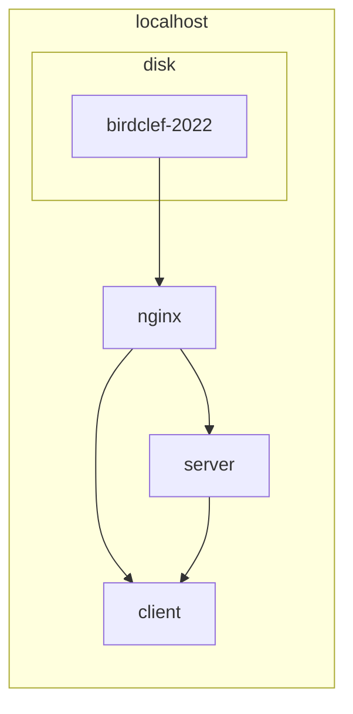
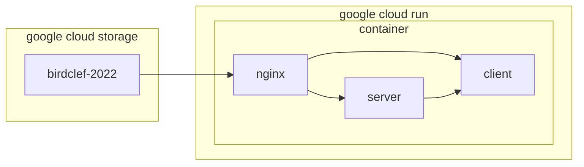

# birdclef-motif-viewer

A small project to visualize motifs using birdclef training data from 2022. The
goal of this tool is to provide a simple way to visualize motifs in a way that
is easy to understand and to compare motifs.

## quickstart

Ensure that you have docker installed. If you are running on Windows, we suggest using WSL2, due to the lack of inotify support on the host filesystem.

```bash
docker compose build
docker compose up
```

## notes

```bash
python scripts/generate-listing.py \
    /mnt/f/kaggle/birdclef-2022/data/raw/birdclef-2022 \
    nginx/birdclef-2022-listing.json
```

### toolchain

We use sveltekit to build the frontend; it's quick to iterate on visual ideas
with minimal boilerplate and a generally well thought out design. On the backend, we use fastapi which is similar to flask, but asynchronous by
default and backed in many places by Pydantic.

Nginx is utilized as a reverse proxy and a static web server. It's relatively
lightweight and straightforward to configure for development and production. Our
configuration will differ depending on where the resources are located (disk or
on GCS), so it's best to have a nginx proxy the results for us. In addition, we
reverse proxy the client and server ports to consolidate a view of the
application.

We use librosa and python-simple-fast to perform most of the audio processing and analysis. The data processing tooling tends to be in Python, so we provide a backend api so that we can offload the heavy processing to a remote server.

### workflow

#### docker-compose



#### cloud run

To deploy this service to the internet, we take some liberties with the way that the application is deployed. We store data to a bucket in google cloud storage (GCS) and make the contents of the bucket accessible to the public. Instead of giving the static, server, and client their own containers to run (as one might do in a Kubernetes cluster), we instead will put each of the constituent services into their own process in a single container. This goes against best practices for general services, but we're optimizing for deployment on Google Cloud Run which only exposes a single port.



- https://medium.com/google-cloud/cloud-run-multiple-processes-4b6f1b3827e
